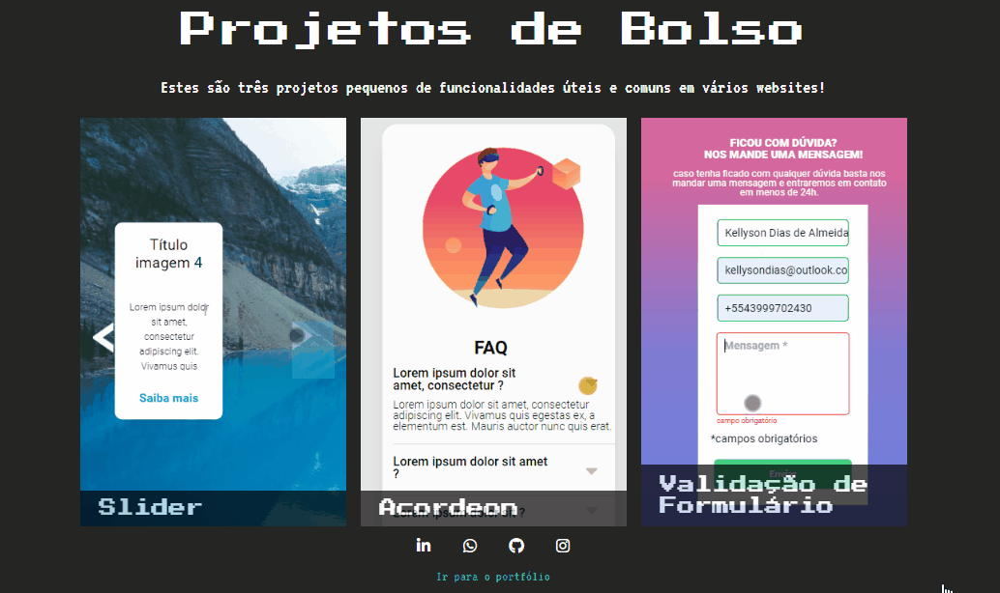
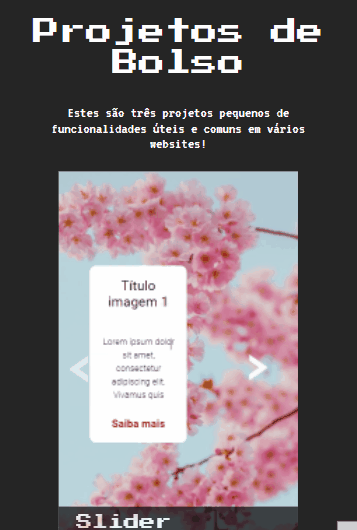

# Projetos de Bolso

## Repositório com projetos pequenos de funcionalidades úteis e comuns em vários websites usando JavaScript, HTML e CSS.

- <a href="">Ver página</a>

## Versão mobile

- <a href="">Ver página</a>

## Tecnologias utilizadas
- HTML
- CSS
- JavaScript